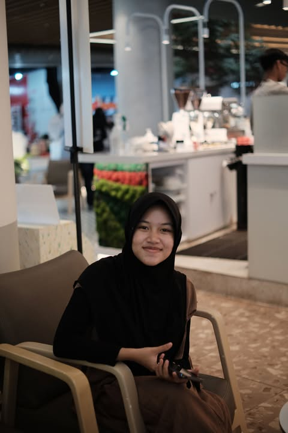

<!--
  ⚡ Profile README for @ghaisaniaurora44-droid
  Drop your photo into this repo as: ghaisani.jpg
-->

<!-- Animated headline -->

  

<!-- Right portrait -->

# Ghaisani Aurora

### 🌈 About Me
Friendly designer-in-tech who loves exploring new ideas, building neat interfaces, and meeting collaborators from everywhere. I’m happiest when learning something new in IT and turning it into helpful, human-centered experiences. Let’s connect and make cool things together! ✨

### 🎯 Interests
Web & App Design • Conflict Mediation • UI/UX Research • E-Learning Innovation • Slow Travel & City Walks

### 🔗 Social

---

## 🧰 Tech Stack

  <!-- Design -->
  &nbsp;
  &nbsp;
  &nbsp;
  <!-- Web -->
  &nbsp;
  &nbsp;
  &nbsp;
  &nbsp;
  &nbsp;
  &nbsp;
  <!-- Backend / Tools -->
  &nbsp;
  &nbsp;
  &nbsp;
  &nbsp;
  &nbsp;

---

## 📊 GitHub Analytics

<!-- Core stats -->

<!-- Most used languages (by bytes) -->

<!-- Profile trophies -->

<!-- Summary cards (include contributions in the last year, top languages by repo/commit) -->

<!-- Activity graph -->

---

## 📌 Featured Projects
> Replace the repo names below with your own to showcase your best work.

  
  
  

---

## 🤝 Open to Collaboration
- UI/UX for web & mobile apps  
- E-learning content and platforms  
- Community projects that make tech more inclusive  

**Let’s chat:**  

&nbsp;•&nbsp;

<!--
Tips:
- Keep the photo file name exactly: ghaisani.jpg
- Update pinned repos in "Featured Projects".
- If any image fails (rare), open it directly in the browser once to refresh the cache.
-->
